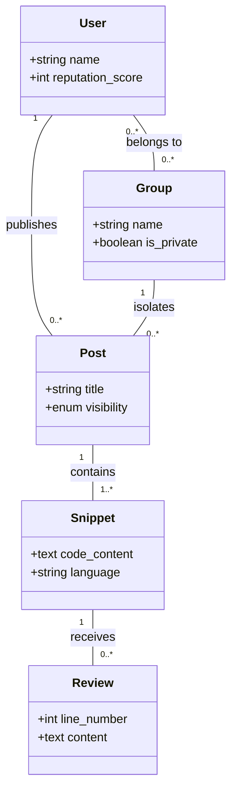
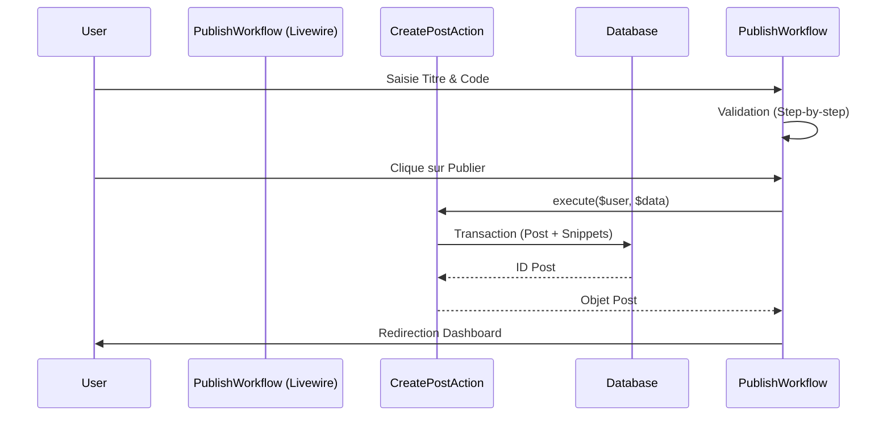

# 🏛️ Architecture & Conception

Ce document décrit les fondations techniques de ReviewMe et les choix de conception qui garantissent sa scalabilité et sa maintenabilité.

## 🚀 Stack Technologique

| Couche | Technologie | Justification |
| :--- | :--- | :--- |
| **Backend** | Laravel 11 (PHP 8.3) | Framework robuste, écosystème mature, productivité. |
| **Frontend** | Livewire 3 + AlpineJS | Approche "Fullstack" réactive sans la complexité d'un SPA lourd (Vue/React). |
| **Styling** | Tailwind CSS v3 | Design system utilitaire pour une UI rapide et cohérente. |
| **Realtime** | Laravel Reverb | WebSockets natifs pour le feedback instantané. |
| **Database** | SQLite (Dev) / MySQL (Prod) | Simplicité en développement, robustesse en production. |

---

## 🏗️ Structure du Projet (Action-Domain)

ReviewMe suit un pattern **Orienté Actions** (Action-Domain-Responder) :

- **`App\Actions`** : Contient l'intelligence métier. Chaque fichier est une action unique (ex: `CreatePostAction`).
- **`App\Models`** : Représente les entités et leurs relations.
- **`App\Livewire`** : Gère l'état de l'UI et délègue la logique aux Actions.
- **`App\Policies`** : Gère les autorisations d'accès aux Groupes (groupes privés).

---

## 📊 Modèle de Domaine (US13)

L'architecture des données repose sur la notion de **Post** (publication) qui possède des **Snippets** (fragments de code).


*Pour plus de détails, voir l'US13 : [Modèle de Domaine](../us/us13_modele_domaine.md).*

---

## 🔄 Parcours Principal (US12)

Le diagramme ci-dessous illustre le cycle de vie d'une publication (Post) et les interactions avec les composants.


*Pour plus de détails, voir l'US12 : [Diagramme de Séquence](../us/us12_diagramme_sequence.md).*

---

## 🛠️ API & Routes

L'application utilise principalement des routes Web dynamiques via Livewire, offrant un contrat d'interface réactif :

- **Auth** : `/login`, `/register`, `/auth/github` (Socialite).
- **Core** : 
    - `/dashboard` : Feed global ordonné par karma.
    - `/publish` : Workflow multi-étapes de publication.
    - `/groups` : Gestion des cercles de confiance.
- **HUD** : `/posts/{id}` : Visionneuse haute densité avec annotations.

---

## 🚚 Déploiement & Livraison

### CI/CD (GitHub Actions)
Chaque push sur la branche `dev` déclenche :
1.  **Linters** : Laravel Pint & ESLint.
2.  **Analyse Statique** : Larastan (Niveau 5).
3.  **Tests** : Suite Pest/PHPUnit.
4.  **Qualité** : Analyse SonarQube Cloud.

### Livraison Production
La branche `main` représente l'état stable de production. La livraison se fait par merge de `dev` vers `main` après validation manuelle du staging (Docker).
Pre-requis production :
```bash
npm run build
php artisan config:cache
php artisan route:cache
```
