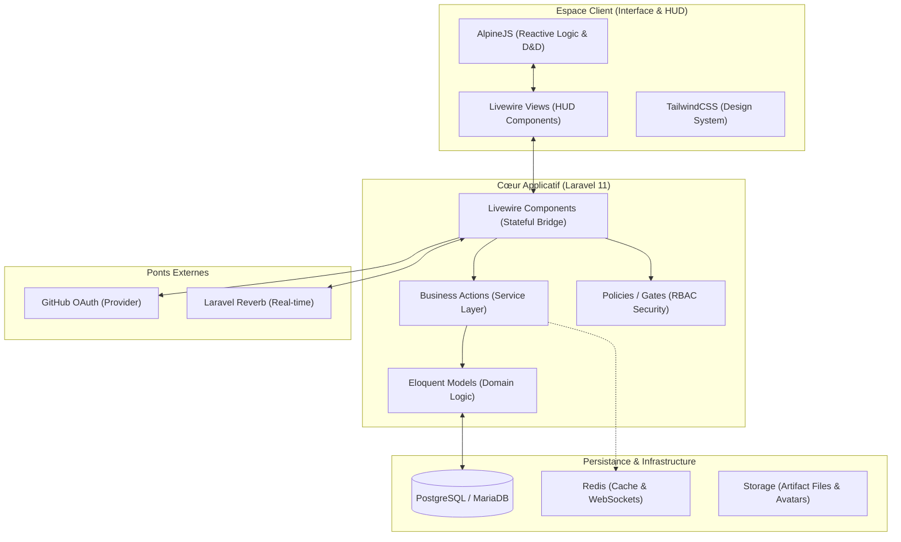

# [Architecture] US10 - Définir l'architecture globale et ses responsabilités

## Description de la story
EN TANT QUE Architecte logiciel  
JE VEUX Décrire les grands blocs de l'application et leurs interactions  
AFIN DE éviter un assemblage opaque et préparer une réalisation maintenable

## Critères d'acceptation
- [x] un schéma d'architecture globale identifie au minimum interface, logique applicative, données et services externes éventuels
- [x] chaque bloc a une responsabilité claire et non redondante
- [x] les flux principaux entre blocs sont explicités
- [x] les limites de l'architecture sont cohérentes avec un projet étudiant et avec le MVP

---

### 1. Schéma d'Architecture (Mermaid)

### 2. Responsabilités des Blocs

*   **Interface (Frontend)** : Gère la présentation réactive, les interactions de drag-and-drop et le feedback sensoriel immédiat (AlpineJS).
*   **Logique Applicative (Backend)** :
    *   *Livewire* : Maintient l'état entre le serveur et le client, orchestre les workflows (ex: Publication).
    *   *Actions* : Classes atomiques (ex: `AddPostVersionAction`) encapsulant les règles métier réutilisables, isolées des contrôleurs.
*   **Données** : Persistance structurée via Eloquent. Utilisation de transactions DB pour garantir l'intégrité (notamment lors de l'upload multi-fichiers).
*   **Services Externes** : Délégation de l'identité à GitHub et gestion du temps-réel via Reverb pour les notifications.

### 3. Flux Principaux

1.  **Workflow de Publication** : Front (File Drop) -> Livewire (Chunking/Upload) -> Action (Validation/Persistence) -> DB.
2.  **Audit de Code** : Front (Selection) -> Livewire (Fetch Fragment) -> Security Policy -> DB -> UI.

### 4. Limites de l'Architecture
L'architecture est optimisée pour une **monolithe modulaire**. Bien que les services de données soient isolés, l'application ne s'appuie pas sur des microservices pour limiter la complexité de déploiement et de communication (latence).
