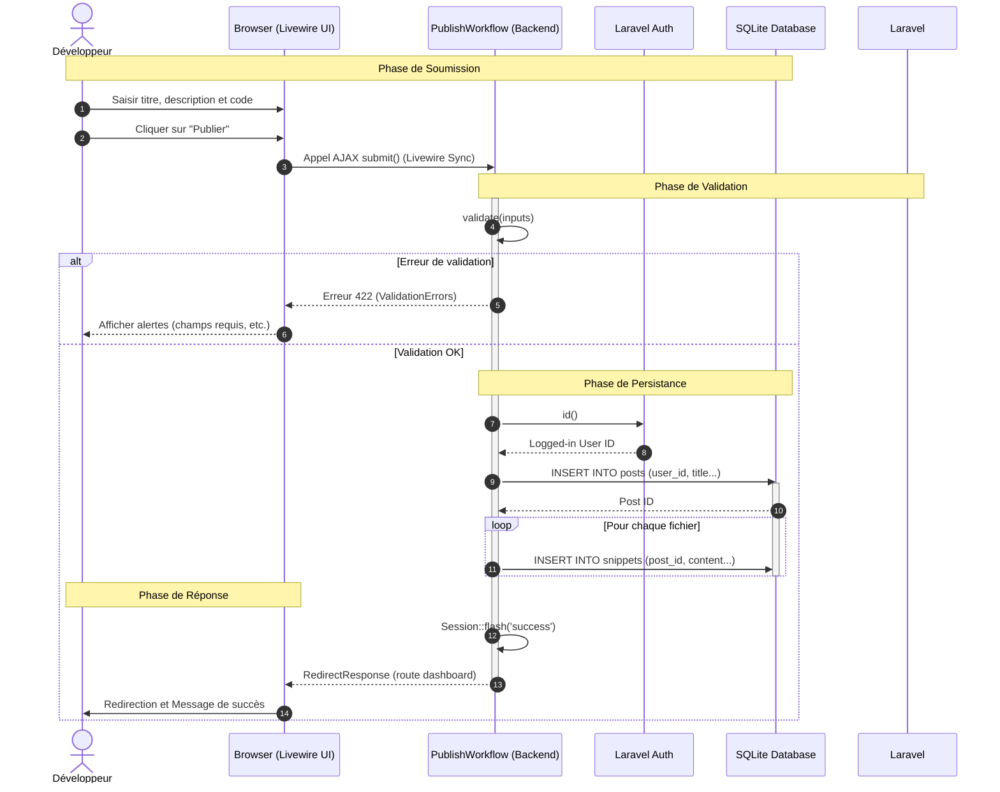

# [Architecture] US12 - Produire le diagramme de séquence du parcours principal

| Attribut | Description |
| :--- | :--- |
| **En tant que** | Architecte logiciel |
| **Je veux** | Modéliser les échanges techniques du cas d'usage central |
| **Afin de** | Clarifier les interactions avant implémentation et limiter les erreurs |

## 1. Cas d'usage : Publication d'une Vibe

Ce cas d'usage décrit le processus technique lorsqu'un développeur souhaite partager un snippet de code (une "Vibe") sur la plateforme ReviewMe.

## 2. Diagramme de Séquence (UML)

## 3. Analyse Technique des Échanges

### 3.1. Soumission (Client vers Serveur)
L'interaction est gérée par **Livewire 3**. Lorsqu'un utilisateur clique sur "Publier", Livewire intercepte l'événement `wire:submit` et envoie une requête JSON contenant l'état actuel du composant (titre, fichiers, visibilité).

### 3.2. Validation & Sécurité
- **Validation** : Le backend utilise le système de validation natif de Laravel (`$this->validate()`). Si une contrainte (ex: `title` trop court) est violée, le flux est interrompu avant toute écriture en base.
- **Authentification** : L'ID de l'utilisateur est récupéré via `auth()->id()`. Si l'utilisateur n'est plus authentifié (session expirée), une exception est levée.

### 3.3. Persistance (Atomicité)
Le modèle de données sépare le contenu descriptif (`Post`) du contenu technique (`Snippets`). 
1. Le `Post` est créé en premier pour générer une clé étrangère.
2. Les `Snippets` sont créés ensuite en référence à ce `Post`.
*Note : Dans une phase ultérieure, ces opérations seront encapsulées dans une Database Transaction pour garantir l'intégrité.*

### 3.4. Retour Utilisateur
Le système utilise un **Message Flash** stocké temporairement en session. La redirection est asynchrone (gérée par le script Livewire au client) pour assurer une transition fluide vers le Dashboard.

## 4. Cas d'Erreur Modélisé
- **Refus de validation** : Le diagramme montre explicitement le retour vers l'UI en cas de données invalides (étape 5 du diagramme), empêchant ainsi la progression vers la base de données.
