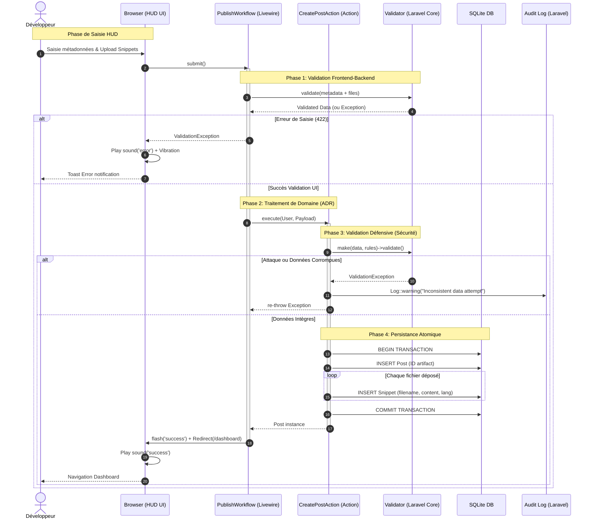

# [Architecture] US12 - Diagramme de Séquence (V2 - Évolué)

| Attribut | Description |
| :--- | :--- |
| **En tant que** | Architecte logiciel |
| **Je veux** | Modéliser les échanges techniques du cas d'usage central |
| **Afin de** | Clarifier les interactions et garantir l'intégrité de la publication |

## 1. Cas d'usage : Publication d'une Vibe (Artefact)

Ce diagramme modélise le flux complexe de création d'un artefact, incluant les couches de sécurité et de persistance atomique.

## 2. Diagramme de Séquence (UML)

## 3. Analyse Technique de l'Évolution

### 3.1. Validation à Double Détente
Le système ne fait plus "aveuglément" confiance au composant Livewire. 
1. **Livewire** valide pour l'expérience utilisateur (erreurs immédiates).
2. **L'Action** valide de nouveau pour la sécurité du domaine. C'est la **Mesure de Sécurité US38** qui empêche toute corruption de base de données via un appel API direct ou un bypass d'UI.

### 3.2. Atomicité & Transactions
La persistance utilise `DB::transaction()`. Si l'insertion d'un seul `Snippet` échoue (ex: disque plein, contrainte violée), le `Post` n'est pas créé non plus. On évite ainsi les "fichiers orphelins" ou des artefacts vides.

### 3.3. Traçabilité (Audit Trail)
En cas de tentative d'injection ou d'accès refusé, la couche `Log` est sollicitée avec le contexte (Utilisateur, IP, Payload). Cela permet une détection proactive d'attaques.

### 3.4. Rendu de l'Expérience (UX)
Le diagramme inclut désormais les signaux haptiques et sonores (`sound('error')`, `sound('success')`), gérés par le service `window.fx` dans `app.js`, pour souligner l'aspect immersif de la plateforme.

## 4. Conformité
- [x] Montre les composants ADR (Action-Domain-Responder).
- [x] Affiche la transaction atomique.
- [x] Inclut au moins un cas d'erreur (ValidationException).
- [x] Inclus l'Audit Logging.
