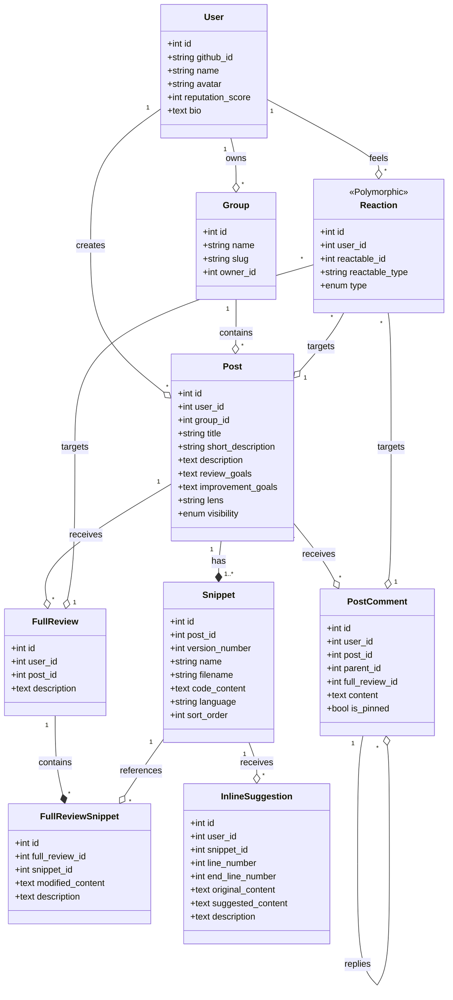

# [Architecture] US13 - Modèle de domaine et Modélisation des données

## Description de la story
EN TANT QUE Architecte logiciel  
JE VEUX Décrire les entités métier, leurs relations et la structure des données  
AFIN DE poser un langage commun entre produit, données et développement

---

## 1. Modèle Conceptuel de Données (UML Mermaid)

---

## 2. Dictionnaire des Données (Champs Réels)

### 2.1. Entités Centrales

| Entité | Champs Clés Appliqués | Description |
| :--- | :--- | :--- |
| **User** | `github_id`, `reputation_score` | Authentification Unique (GitHub). |
| **Group** | `name`, `slug`, `owner_id` | Règle de visibilité privée/semi-privée. |
| **Post** | `review_goals`, `improvement_goals`, `lens`, `visibility` | Unité de curation. Les Lenses (`lens`) stockent les focus choisis (ex: `logic,opti`). |
| **Snippet** | `version_number`, `filename`, `sort_order` | Fragment de code. L'unicité est gérée par le couple (post_id, filename, version_number). |

### 2.2. Entités de Feedback & Collaboration

| Entité | Champs Clés Appliqués | Description |
| :--- | :--- | :--- |
| **FullReview** | `post_id`, `description` | Revue globale (PR-Style) avec propositions de modifications majeures. |
| **InlineSuggestion** | `line_number`, `end_line_number`, `suggested_content` | Micro-modification ciblée sur une ou plusieurs lignes de code. |
| **PostComment** | `parent_id`, `full_review_id`, `is_pinned` | Discussion threadée. Peut être rattachée à une `FullReview`. |
| **Reaction** | `reactable_type`, `type` | Support des types `up`, `down`, `like`. |

---

## 3. Règles Métier & Contraintes de Données

1. **Intégrité de Versioning** : Chaque `Snippet` appartient à une `version_number`. La suppression d'un `Post` entraîne la suppression en cascade de toutes ses versions.
2. **Unicité Technologique** : Interdiction d'avoir deux fichiers avec le même `filename` dans la même version d'un `Post` (sécurisé par le MD5 Guard du workflow).
3. **Hiérarchie RBAC** :
    - `is_pinned` : Seuls les administrateurs ou experts certifiés peuvent épingler des commentaires pour hiérarchiser les retours.
    - `FullReview` : Seuls l'auteur original peut itérer (nouvelle version) mais tout le monde peut proposer une `FullReview`.

---

## 4. Nomenclature Professionnelle (Source of Truth)

- **Post** : (ex-Vibe) L'entité maîtresse du flux.
- **Group** : (ex-Lab) Unité de collaboration restreinte.
- **Snippet** : Fragment de code technique.
- **Lens** : Axe d'analyse chromatique (Logic, Beauty, Opti).
