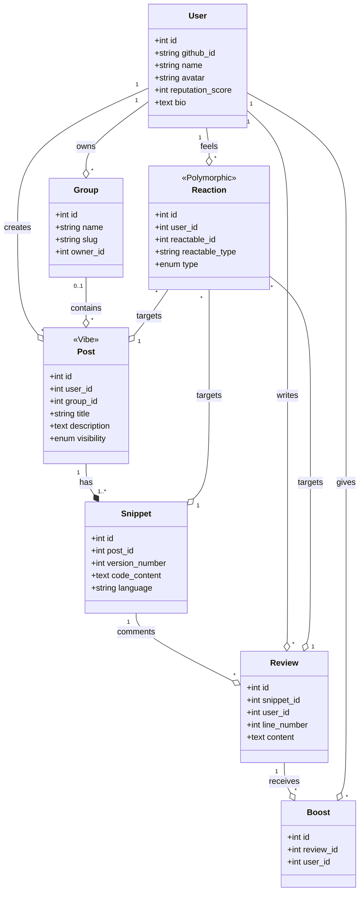

# [Architecture] US13 - Modèle de domaine et Modélisation des données

| Attribut | Description |
| :--- | :--- |
| **En tant que** | Architecte logiciel |
| **Je veux** | Décrire les entités métier, leurs relations et la structure des données |
| **Afin de** | Poser un langage commun entre produit, données et développement |

## 1. Modèle Conceptuel de Données (UML)

## 2. Dictionnaire des Données

### 2.1. Entités Principales

| Entité | Description | Champs Clés |
| :--- | :--- | :--- |
| **User** | Utilisateurs authentifiés via GitHub. La réputation évolue via les "Boosts". | `github_id` (Unique), `reputation_score` |
| **Group** | Communautés ou équipes structurant la visibilité des Vibes. | `slug` (Unique), `owner_id` |
| **Post** (Vibe) | Demande de revue ou partage de code. Unité centrale du flux. | `visibility` (public, private, group) |
| **Snippet** | Fragment de code réel. Gère l'historique des modifications (Versioning). | `version_number`, `code_content` |
| **Review** | Feedback textuel, potentiellement lié à une ligne précise du Snippet. | `line_number` |
| **Reaction** | Feedback rapide et catégorisé (Clean, Optimisable, Mindblown, Security). | `type` (Enum) |
| **Boost** | Système d'encouragement spécifique sur les reviews pertinentes. | `user_id`, `review_id` |

## 3. Règles Métier & Contraintes

1. **Authentification Unique** : Seul GitHub OAuth est autorisé pour la création de compte.
2. **Cycle de vie du Code** : Une "Vibe" commence par un `Snippet` (V1). Chaque mise à jour majeure du code crée un nouveau `Snippet` rattaché au même `Post`.
3. **Hiérarchie de Feedback** :
    - On **Réagit** (Reaction) à un Post ou un Snippet pour donner une impression technique.
    - On **Commente** (Review) un Snippet pour une analyse détaillée.
    - On **Boost** une Review pour valider la justesse du feedback.
4. **Visibilité** :
    - `public` : Visible par tous.
    - `group` : Visible uniquement par les membres du `group_id` associé.
    - `private` : Visible uniquement par l'auteur.

## 4. Langage Commun (Ubiquitous Language)

- **Vibe** : Synonyme de Post. C'est le partage initial.
- **Snippet** : Un instantané de code à un moment T.
- **Boost** : Acte de gratitude validant une expertise.
- **Reputation** : Score global reflétant la qualité des contributions d'un développeur.
