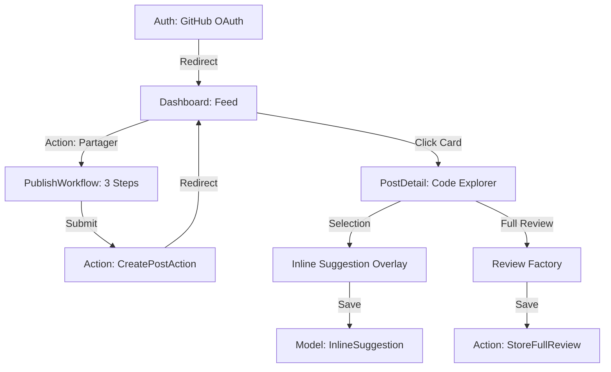

# [Dev] US23 - Implémenter le parcours utilisateur principal

## Description de la story
EN TANT QUE Étudiant utilisateur  
JE VEUX Réaliser de bout en bout le parcours qui porte la valeur principale du produit  
AFIN DE livrer un produit démontrable et non une collection d'écrans sans logique

---

## 1. Traçabilité Technique du Parcours

Le parcours utilisateur principal repose sur une architecture découplée utilisant Livewire pour l'interface et des Actions pour la logique métier.

### 1.1 Chaîne d'Exécution (Flux Nominal)

### 1.2 Points d'Entrée (Routes)
- **Authentification** : `Route::get('/auth/github')` ([GithubAuthController.php](file:///Users/Nolhan/Documents/reviewme/app/Http/Controllers/Auth/GithubAuthController.php))
- **Dashboard** : `Route::get('/dashboard')` ([Feed.php](file:///Users/Nolhan/Documents/reviewme/app/Livewire/Feed.php))
- **Tunnel de Publication** : `Route::get('/publish')` ([PublishWorkflow.php](file:///Users/Nolhan/Documents/reviewme/app/Livewire/PublishWorkflow.php))
- **Explorateur de Code** : `Route::get('/posts/{postId}')` ([PostDetail.php](file:///Users/Nolhan/Documents/reviewme/app/Livewire/PostDetail.php))

---

## 2. Logique Métier & Validation

Le parcours est sécurisé par des transactions atomiques et une validation rigoureuse.

### 2.1 Persistance Atomique
La création d'un post et de ses fragments (Snippets) est gérée par `CreatePostAction.php` via une transaction `DB::transaction`. Cela garantit qu'aucun post "orphelin" n'est créé en cas d'erreur de téléchargement de fichier.

### 2.2 Rétroaction Utilisateur (HUD)
- **Succès** : Notification via le composant `toast-hud` déclenchée par l'événement `post-action`.
- **Chargement** : Barre de progression progressive au sommet du viewport via `global-loader`.

---

## 3. Preuves de Réalisation (DoD)

### 3.1 Tests de Couverture
- **Tests Fonctionnels** : 
    - [PublishWorkflowTest.php](file:///Users/Nolhan/Documents/reviewme/tests/Feature/PublishWorkflowTest.php) : Valide l'import multi-fichiers, la détection MD5 et la soumission finale.
    - [PostDetailTest.php](file:///Users/Nolhan/Documents/reviewme/tests/Feature/PostDetailTest.php) : Valide l'ajout de commentaires contextuels et les réactions.
- **Tests Unitaires** : 
    - `ReputationSystemTest.php` : Vérifie que le karma de l'auteur augmente lors d'interactions sur le parcours principal.

### 3.2 Commits de Référence (Historique)
- `feat(publish): implémentation du stepper et de la télémétrie LOC/KB`
- `feat(collaboration): système de suggestion inline avec live diff engine`
- `fix(security): durcissement des ACL via PostPolicy sur le détail`
